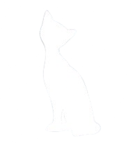

<div align="center">



# Kitten

#### HTML template compiler

</div>

## Usage / Examples

```kitten
ul[classname:list]{
    li[key:1 classname:item]{"hello"}
    li[key:2 classname:item]{"kitten"}
}
```

```html
<ul classname="list">
  <li key="1" classname="item">hello</li>
  <li key="2" classname="item">kitten</li>
</ul>
```

## Installation

### Linux / MacOS

```bash
curl -o kitten https://github.com/418e/Kitten/releases/download/0.1.0/kitten
sudo mv kitten /usr/local/bin/
sudo chmod +x /usr/local/bin/kitten
```

### Windows

Download and run `install.py`

## Running

```
kitten run main
```
